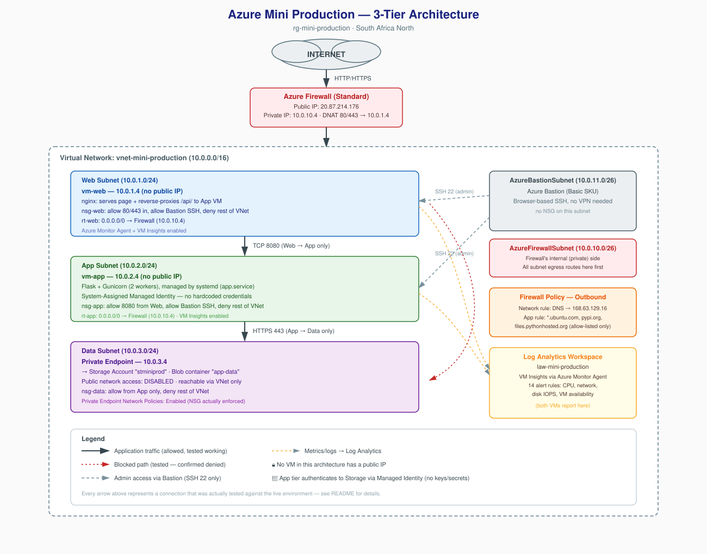

# Azure Mini Production — Secure 3-Tier Cloud Infrastructure

A hand-built, security-hardened, monitored 3-tier architecture on Azure — segmented network, zero public IPs on backend resources, and a working end-to-end application proving the design actually functions, not just diagrams that describe it.

Every resource in this project was deployed manually through the Azure Portal, resource by resource, with each layer tested and verified live before moving to the next — including deliberately trying to break the network isolation to confirm it actually holds.



## Table of Contents

- [Overview](#overview)
- [Architecture](#architecture)
- [Azure Resources Deployed](#azure-resources-deployed)
- [Network Design](#network-design)
- [Security Design](#security-design)
- [Application Layer](#application-layer)
- [Monitoring & Observability](#monitoring--observability)
- [Testing & Validation](#testing--validation)
- [What I Learned](#what-i-learned)
- [Skills Demonstrated](#skills-demonstrated)
- [Repo Structure](#repo-structure)
- [Screenshots](#screenshots)
- [Cost Considerations & Teardown](#cost-considerations--teardown)
- [Possible Future Enhancements](#possible-future-enhancements)

## Overview

This project simulates a real production environment: a public-facing web tier, an internal application tier, and an isolated data tier, connected through Azure Firewall and protected by layered Network Security Groups.

**Region:** South Africa North
**Resource Group:** `rg-mini-production`
**Status:** Complete — manually built, fully tested, application layer live

## Architecture

```
INTERNET
   │
   ▼
Azure Firewall (Standard) — Public IP 20.87.214.176
   │  DNAT: 80,443 → Web VM
   ▼
┌─────────────────────────────────────────────┐
│  VNet: vnet-mini-production (10.0.0.0/16)    │
│                                               │
│  Web Subnet (10.0.1.0/24)                    │
│   └─ vm-web (10.0.1.4) — nginx + static page │
│                │ TCP 8080                    │
│                ▼                             │
│  App Subnet (10.0.2.0/24)                    │
│   └─ vm-app (10.0.2.4) — Flask + Gunicorn    │
│                │ HTTPS 443 (Private Endpoint)│
│                ▼                             │
│  Data Subnet (10.0.3.0/24)                   │
│   └─ Private Endpoint (10.0.3.4)             │
│        └─ Storage Account (Blob container)   │
│                                               │
│  AzureBastionSubnet — Bastion (admin access) │
│  AzureFirewallSubnet — Firewall private side │
└─────────────────────────────────────────────┘
        │
        ▼
Log Analytics Workspace — VM Insights + 14 Alert Rules
```

No VM in this project has a public IP. All administrative access is via Azure Bastion; all internet-facing traffic is inspected and forwarded by Azure Firewall.

## Azure Resources Deployed

| Resource | Name | Purpose |
|---|---|---|
| Resource Group | `rg-mini-production` | Container for all resources |
| Virtual Network | `vnet-mini-production` | 10.0.0.0/16, 5 subnets |
| Network Security Groups | `nsg-web`, `nsg-app`, `nsg-data` | Per-subnet traffic filtering |
| Route Tables | `rt-web`, `rt-app`, `rt-data` | Force egress through Firewall |
| Azure Firewall | (Standard SKU) | Inbound DNAT + outbound allow-listing |
| Firewall Policy | — | DNAT, Network, and Application rule collections |
| Azure Bastion | `vnet-mini-production-Bastion` | Basic SKU, browser-based admin access |
| Virtual Machines | `vm-web`, `vm-app` | Ubuntu, Standard_B2ats_v2, no public IPs |
| Storage Account | `stminiprod` | Standard LRS, public access disabled |
| Blob Container | `app-data` | Stores JSON entries written by the app |
| Private Endpoint | `pe-storage-data` | Gives the Storage Account a private IP in the Data subnet |
| Private DNS Zone | `privatelink.blob.core.windows.net` | Resolves the storage FQDN to its private IP |
| Log Analytics Workspace | `law-mini-production` | Central store for metrics/logs |
| Managed Identity | System-assigned on `vm-app` | Keyless authentication to Storage |

## Network Design

| Subnet | CIDR | Contents |
|---|---|---|
| web-subnet | 10.0.1.0/24 | vm-web |
| app-subnet | 10.0.2.0/24 | vm-app |
| data-subnet | 10.0.3.0/24 | Private Endpoint → Storage |
| AzureFirewallSubnet | 10.0.10.0/26 | Azure Firewall (private side) |
| AzureBastionSubnet | 10.0.11.0/26 | Azure Bastion |

### NSG Rules (custom rules only — defaults omitted)

**nsg-web**
| Priority | Name | Port | Source | Action |
|---|---|---|---|---|
| 100 | Allow-HTTP | 80 | Any | Allow |
| 110 | Allow-HTTPS | 443 | Any | Allow |
| 120 | Allow-Bastion-SSH | 22 | 10.0.11.0/26 | Allow |
| 200 | Deny-Rest-Of-Vnet | Any | VirtualNetwork | Deny |

**nsg-app**
| Priority | Name | Port | Source | Action |
|---|---|---|---|---|
| 100 | Allow-Web-to-App-8080 | 8080 | 10.0.1.0/24 | Allow |
| 150 | Allow-Bastion-SSH | 22 | 10.0.11.0/26 | Allow |
| 200 | Deny-Rest-Of-Vnet | Any | VirtualNetwork | Deny |

**nsg-data**
| Priority | Name | Port | Source | Action |
|---|---|---|---|---|
| 100 | Allow-App-to-Data | Any | 10.0.2.0/24 | Allow |
| 200 | Deny-Rest-Of-Vnet | Any | VirtualNetwork | Deny |

### Route Tables

All three subnets (Web, App, Data) route `0.0.0.0/0` to the Firewall's private IP (`10.0.10.4`) as a Virtual Appliance next hop — no subnet has a direct path to the internet.

### Firewall Policy Rules

| Type | Rule | Purpose |
|---|---|---|
| DNAT | 20.87.214.176:80 → 10.0.1.4:80 | Inbound HTTP to Web VM |
| DNAT | 20.87.214.176:443 → 10.0.1.4:443 | Inbound HTTPS to Web VM |
| Network | Allow DNS (UDP/TCP 53) → 168.63.129.16 | Name resolution for all subnets |
| Application | Allow HTTPS/HTTP → `*.ubuntu.com` | `apt` package installs/updates |
| Application | Allow HTTPS → `pypi.org`, `files.pythonhosted.org` | `pip` package installs |

## Security Design

| Layer | Control |
|---|---|
| Network segmentation | 3 subnets (Web / App / Data), each with its own NSG |
| East-west traffic | NSGs explicitly allow only Web→App (8080) and App→Data; `Deny-Rest-Of-Vnet` blocks everything else |
| North-south traffic | All subnet egress routed through Azure Firewall via UDR — no direct internet path from any subnet |
| Inbound access | Only Firewall DNAT rules (80/443 → Web VM) allow anything in from the internet |
| Outbound access | Firewall rules explicitly allow only DNS, Ubuntu repos, and PyPI — nothing else egresses |
| Admin access | Azure Bastion only; NSGs allow port 22 only from the Bastion subnet; no SSH/RDP exposed to the internet |
| Data tier isolation | Storage Account has public network access disabled; reachable only via Private Endpoint; Private Endpoint Network Policies enabled so nsg-data is actually enforced against it |
| Least privilege | App VM's managed identity is granted only `Storage Blob Data Contributor`, not account-level Contributor/Owner |
| Secrets management | Zero credentials in code — the App VM authenticates to Storage via its Managed Identity |

### A real bug found and fixed during this build

Azure NSGs always include a default `AllowVnetInBound` rule (priority 65000) permitting any traffic between subnets in the same VNet. This silently overrides an intended "allow only X" rule unless an explicit `Deny` is added above it. This project initially had exactly that gap — the Web tier could reach the Data tier directly despite an "App-only" rule being in place. It was diagnosed by reading the NSG evaluation order rule-by-rule, fixed by adding explicit deny rules (with a carved-out exception for Bastion on all three NSGs), and **proven fixed** by testing that Web→Storage times out while App→Storage still succeeds.

A second, related gotcha: Private Endpoints ignore their subnet's NSG by default (`Network Policies: Disabled`) — meaning `nsg-data`'s rules weren't actually being enforced against the storage account at all until that subnet setting was explicitly flipped to enabled.

## Application Layer

- **Web tier (`vm-web`):** nginx serves a static HTML/JS page and reverse-proxies any `/api/*` request to the App tier over the internal network.
- **App tier (`vm-app`):** a Flask API with three routes (`/api/health`, `GET /api/entries`, `POST /api/entries`), served by **Gunicorn** (2 worker processes) and supervised by a **systemd** unit (`app.service`, `Restart=always`) — so it survives reboots and doesn't depend on any terminal session staying open.
- **Data tier:** the Flask app uses the `azure-identity` and `azure-storage-blob` SDKs with `DefaultAzureCredential`, which automatically authenticates using the VM's Managed Identity — no connection string or access key exists anywhere in the code or config.

```ini
# /etc/systemd/system/app.service
[Unit]
Description=Gunicorn instance serving the Flask app
After=network.target

[Service]
User=azureuser
WorkingDirectory=/home/azureuser/app
Environment="PATH=/home/azureuser/app/venv/bin"
ExecStart=/home/azureuser/app/venv/bin/gunicorn --bind 0.0.0.0:8080 --workers 2 app:app
Restart=always
RestartSec=5

[Install]
WantedBy=multi-user.target
```

## Monitoring & Observability

- **Log Analytics Workspace** (`law-mini-production`) centralizes metrics and logs from both VMs.
- **VM Insights**, via the Azure Monitor Agent, is enabled on both `vm-web` and `vm-app`.
- **14 alert rules** were provisioned (Azure's recommended set), covering CPU percentage, network in/out, disk IOPS, and VM availability, across both VMs.

## Testing & Validation

Every item below was actually run against the live environment:

- [x] Web VM: outbound DNS resolution + `apt update` succeed through the Firewall
- [x] App VM: outbound DNS resolution + `apt update` + `pip install` succeed through the Firewall
- [x] Web VM → App VM on port 8080 succeeds (NSG allow rule working)
- [x] App VM → Storage Account succeeds via Private Endpoint
- [x] **Web VM → Storage Account fails (connection timed out)** — proving Data tier isolation is real, not assumed
- [x] Bastion connectivity re-confirmed working immediately after the NSG lockdown (no admin lockout)
- [x] `app.service` survives a fully closed and reopened Bastion session (genuine background service)
- [x] Full browser round-trip: submit a message on the public page → written to Blob Storage → read back and displayed

## What I Learned

- How Azure evaluates NSG rules in priority order, and why default rules can silently undermine rules you think are restrictive.
- The difference between a resource's public IP and private IP, and why a Firewall's *next hop* for internal traffic is always its private side.
- Why Private Endpoints need their subnet's "Network Policies" explicitly enabled before NSGs apply to them at all.
- The difference between Azure Firewall Network Rules (IP/port) and Application Rules (FQDN-based), and when each is the right tool.
- How to run a Python web app as a real background service (Gunicorn + systemd) instead of a fragile terminal session.
- Why Managed Identity is a meaningfully better pattern than embedding storage keys or connection strings in application code.
- How to design and prove network isolation, rather than just configuring it and assuming it works.

## Skills Demonstrated

Azure networking (VNets, subnets, NSGs, UDRs) · Azure Firewall & Firewall Policy · Azure Bastion · Linux VM administration (Ubuntu) · Identity & access management (Managed Identity, RBAC least privilege) · Blob Storage & Private Endpoints · Azure Monitor / Log Analytics · Python (Flask, Gunicorn) · systemd service management · nginx reverse proxying · Methodical network troubleshooting and security validation

## Repo Structure

```
.
├── README.md
├── architecture-diagram.svg
├── screenshots.md
└── screenshots/
```

## Screenshots

See [`screenshots.md`](./screenshots.md) for the full checklist and file naming convention used in the `screenshots/` folder — covering networking, security, compute, storage, monitoring, and the live application demo.

## Cost Considerations & Teardown

This environment uses low-cost SKUs throughout (Standard_B2ats_v2 VMs, Basic Bastion, Standard Firewall, LRS storage), but **Azure Firewall and Bastion both carry an hourly cost regardless of usage**. If replicating this project, delete the resource group when not actively demoing it to avoid ongoing charges:

```bash
az group delete --name rg-mini-production --yes --no-wait
```

## Possible Future Enhancements

These were considered but intentionally left out of scope for this iteration, which focused on manually building and deeply understanding each resource rather than automating the deployment:

- Infrastructure as Code (Terraform or Bicep) rewrite
- HTTPS/TLS termination on the public endpoint (currently HTTP only, for demo simplicity)
- CI/CD pipeline for application deployment
- Autoscaling for the App tier

## Author

Built by [Your Name] as a hands-on infrastructure learning project — designed, deployed, secured, and validated resource by resource rather than following a single tutorial end to end.
